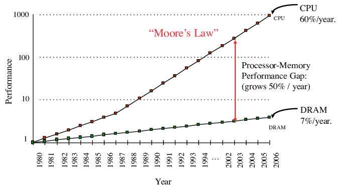

# Intro: Scientific Computing in Julia

## Quantecon workshop at Chilean Central Bank, 2022

Pablo Winant

----

## Course Goals

- Intro to Julia
  - quick overiew, explanations on demand
  - show how to use several common algorithms
  - alternate by-hand coding and using ready-made libraries
- Perturbation
- Time Iteration Methods
- -> Ayiagari-style model

----

## Quick personal intro

- my job
  - teaching at ESCP/Ecole Polytechnique
  - research on inequality, monpol, international finance and
  - ...computational methods
- work on various opensource projects:
  - interpolation.py (interpolation in python)
  - dolo.py/dolo.jl (language to describe optimization models)
  - dolark.py/dolark.jl (same for heterogenous agents)
  - tangentially: hark, quantecon, ...

---

## Julia Environments

----

### Installing Julia

- To get Julia on your laptop:
  1. install JuliaUp (it can keep several versions in parallel)
  2. install VSCode then install julia plugin
  3. to edit jupyter notebooks, install Julia package IJulia
- Online options:
  - github codespaces / gitpod
  - mybinder (requires Project.toml)
  - colab (requires installation everytime)

----

### Julia Console

- Accessible:
    - from a good terminal
    - from VSCode panel
    - from jupyter(lab) console
- Four modes:
    - ``: REPL (read-eval-print)
    - `?`: Help
    - `]`: Package Management
    - `;`: System Console

----

### Julia package ecosystem

- Large package ecosystem
- Fairly good quality native code
- A lot of research-grade code
  - sometimes state of projects is not obvious
  - check docs / ask community
- Wrappers to low-level / foreign language libraries
  - C: `ccall`
  - Fortran: `fcall`
  - Python: `PyCall`

----

### How do you install packages?

- Short and wrong answer: `] add PackageName`
- Better answer:
  - a project environment specifies all dependencies for a project
    - informations are contained in `Project.toml`
  - change directory to the right project
    - `; cd path_to_the_right_project`
    - you can check where you are `; pwd` (print working directory)
  - activate environment:
    - `] activate .`  (`.` universally means current director)
  - add desired package:
    - `] add PackageName`
  - when you restart work on a project activate, it again, to ensure you have the right dependencies

----

### Julia resources

- Many excellent online resources:
    - [Software Carpentry](https://software-carpentry.org/)
    - [QuantEcon](https://quantecon.org/) from Tom Sargent and John Stachurski
      - [cheatsheet](https://cheatsheets.quantecon.org/)
    - [Julia manuals/tutorials](https://julialang.org/learning/)
- Opensource community is very welcoming:
    - ask on mailing lists or online chats (Julia users, quantecon, dynare, ...)
    - open issues (for instance against Dolo [https://github.com/EconForge/Dolo.jl/issues](https://github.com/EconForge/Dolo.jl/issues)
    - participating is also a great occasion to learn

---

# Random considerations

----

## Programming spirit

- ideal qualities of a programming language
  - easy (simple constructs and syntactic sugar)
  - elegant (concise, close to algorithmic/mathematical description)
  - optimizable (able to generate efficient machine code)
  - deep (a lot to learn ;-))
- Julia comes close in many directions
  - in great part due to its "type system" and multiple dispatch

----

## Optimization strategies

- optimization strategies with Julia
  - algorithmic improvements
  - efficient compilation
    - provide the compiler with enough information
    - optimize compilation steps
      - (julia->llvm->llvm-IR->CPU)
  - memory management
    - avoid memory allocations
  - vectorization / parallelization
    - target SSD operations, GPU, multiproc, ...
  - differentiable programming

----

## Why is memory management so important?

- in the julia community "memory allocation" means "heap allocation" 
  - it uses the equivalent of C's `memalloc`
- "stack allocated" variables are completely known by the compiler

----

## Optimization strategies (today)

- In this curse we will (mostly)
  - provide just enough type information to avoid performance hits
  - use some zero-cost abstractions to write more transparent/generic code
  - use autodiff when possible, fall back on finitediff when not
  - no more optimization...

---
