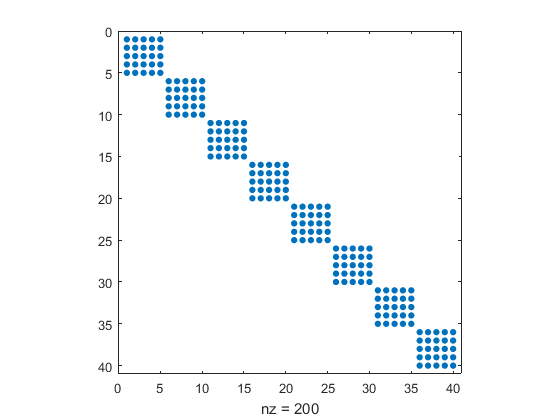
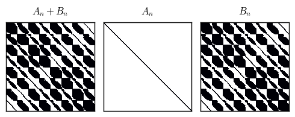

# Two Time Iteration Methods

## Computational workshop at Chilean Central Bank - 2022

Pablo Winant

----

- In this lecture: introduce the time iteration algorithms a faster variant, improved time iteration
- Advantages of TI:
  - very little assumptions about the model structure
  - allows for easy vectorisation / parallelisation
  - can deal with occasionally binding constraints
  - completely agnostic to the kind of interpolation used

---

## First order representation of a model

----

### Generic Value Function Representation

- All variables of the model are vectors:
  - states $s \in \mathcal{S} \subset R^{n_s}$
  - controls $x \in \mathcal{F}(\mathcal{S}, R^{n_x})$
    - we assume bounds $a(s)\leq x \leq b(s)$
  - shocks: $\epsilon \sim \text{i.i.d. distrib}$
- Transition:
$$s_{t+1} = g(s_t, x_t, \epsilon_{t+1})$$
- Value function: $$V(s) = E_0 \sum_{t\geq 0} \beta^t \left[ U(s_t, x_t)\right]$$
- Solution is a function $V()$ (value) which is a fixed point of the Bellman-operator:
$$\forall s, V(s) = \max_{a(s)\leq x \leq b(s)} U(s,x) + \beta E \left[ V(g(s,x,\epsilon)) \right]$$
- The argmax, defines a decision rule *function*: $x = \varphi(s)$

----

### First order representation

- All variables of the model are vectors:
  - states $s_t$ 
  - controls $x_t$
    - we assume bounds $a(s)\leq x \leq b(s)$
  - shocks: $\epsilon_t$ (i.i.d. random law)
- Transition:
$$s_{t+1} = g(s_t, x_t, \epsilon_{t+1})$$
- Decision rule: $$x_t = \varphi(s_t)$$
- Arbitrage:
$$ E_t\left[ f(s_t, x_t, s_{t+1}, x_{t+1}) \right] = 0 \perp a(s_t) \leq x_t \leq b(s_t) $$

- These equations must be true for any $s_t$.
- Remark: time subscript are conventional. They are used to precise:
  - when expectation is taken (w.r.t $\epsilon_{t+1}$)
  - to avoid repeating $x_t=\varphi(s_t)$ and $x_{t+1} = \varphi(s_t)$
- Sometimes there are bounds on the controls
  - we encode them with complementarity constraints
  - more on it later
  

 

----

### Example 1: neoclasical growth model

- capital accumulation:
$$k_t = (1-\delta)k_{t-1} + i_{t-1}$$
- production:
$$y_t = k_t^\alpha$$
- consumption:
$$c_t = (1-s_t) y_t$$
$$i_t = s_t y_t$$
- optimality:
$$\beta E_t \left[ \frac{U^{\prime}(c_{t+1})}{U^{\prime}(c_{t})} (1-\delta + k_{t+1}^{\alpha-1}\alpha) \right]= 1$$

- states: $k_t$, with one transition equation
- controls: $y_t, c_t, i_t, s_t$, with four "arbitrage" equations
  - it is possible but not mandatory to reduce the number of variables/equations by simple susbtitutions
  

----

### Example 2: consumption-savings model

Simplest consumption/savings model:

- Transition: $$w_t = \exp(\epsilon_t) + (w_{t-1} - c_{t-1}) \overline{r}$$
- Objective: $$\max_{0\leq c_t \leq w_t} E_0 \left[ \sum \beta^t U(c_t) \right]$$
- First order conditions:
$$\beta E_t \left[  \frac{U^{\prime}(c\_{t+1})}{U^{\prime}(c_t)} \overline{r} \right] - 1 \perp 0 \leq c_t \leq w_t$$

- F.O.C. reads as: 
$$\beta E_t \left[  \frac{U^{\prime}(c\_{t+1})}{U^{\prime}(c_t)} \overline{r} \right] - 1 \leq 0 \perp c_t \leq w_t$$ and $$0 \leq \beta E_t \left[  \frac{U^{\prime}(c\_{t+1})}{U^{\prime}(c_t)} \overline{r} \right] - 1  \perp 0 \leq c_t $$

- First one reads: *if my marginal utility of consumption today is higher than expected mg. utility of cons. tomorrow, I'd like to consume more, but I can't because, consumption is bounded by income (and no-borrowing constraint).*
- Second one reads: *only way I could tolerate higher utility in the present, than in the future, would be if I want dissave more than I can, or equivalently, consume less than zero*. This is never happening.

----

### Example 3: new-keynesian with / without ZLB

Consider the new keynesian model we have seen in the introduction:
- Assume $z_t$ is an autocorrelated shock:
$$z_t = \rho z_{t-1} + \epsilon_t$$
- new philips curve (PC):$$\pi_t = \beta \mathbb{E}\_t \pi_{t+1} + \kappa y_t$$
- dynamic investment-saving equation (IS):$$y_t = \beta \mathbb{E}\_t y_{t+1} - \frac{1}{\sigma}(i_t - \mathbb{E}\_t(\pi_{t+1}) ) - {\color{green} z_t}$$
- Interest Rate Setting (taylor rule): $$i_t = \alpha_{\pi} \pi_t + \alpha_{y} y_t$$

- The model satisfies the same specification with:
  - one state $z_t$ and one transition equation
  - three controls: $\pi_t$, $y_t$ and $i_t$ with three "arbitrage" equation
- These are not real first order conditions as they are not derived from a maximization program
  - unless one tries to microfound them...
- It is possible to add a zero-lower bound constraint by replacing IRS with:
$$ \alpha_{\pi} \pi_t + \alpha_{y} y_t \leq i_t \perp 0 \leq i_t$$

---

## Time iteration

----

### Time iteration

- So we have the equation, $\forall s_t$

$$ E_t\left[ f(s_t, x_t, s_{t+1}, x_{t+1}) \right] = 0 \perp a(s_t) \leq x_t \leq b(s_t)$$$$ E_t\left[ f(s_t, x_t, s_{t+1}, x_{t+1}) \right] = 0$$

 where
$$s_{t+1} = g(s_t, x_t, \epsilon_{t+1})$$
$$x_t = \varphi(s_t)$$
$$x_{t+1} = \tilde{\varphi}(s_{t+1})$$
- <!-- .element class="fragment" data-fragment-index="2" --> Let's leave the complementarity conditions aside for now
- In equilibrium $\tilde{\varphi} = {\varphi}$

----

### Time iteration

- We can rewrite everything as one big functional equation:
$$\forall s, \Phi(\varphi, \tilde{\varphi})(s) = E\left[ f(s, \varphi(s), g(s,\varphi(s), \epsilon), \tilde{\varphi}(g(s,\varphi(s), \epsilon)) \right]$$
- A solution  is $\varphi$ such that $\Phi(\varphi, \varphi) = 0$
- The Coleman operator $\mathcal{T}$ is defined implicitly by: 
$$\Phi(\mathcal{T}(\varphi), \varphi)=0$$
- The core of the time iteration algorithm, consists in the recursion:
$$\varphi_{n+1} = \mathcal{T}(\varphi_n)$$
- It maps future decision rules to current decision rules
  - same as "linear time iterations", remember?
- Sounds fun but how do we implement it concretely?

----

### Practical implementation

- We need to find a way to:
  1. compute expectations
  2. represent decision rules $\varphi$ and $\varphi$ with a finite number of parameters

----

### Practical implementation (2)

- Computing expectations:
  - discretize shock $\epsilon$ with finite quantization $(w_i, e_i)_{i=1:K}$
    - quantization can be quadrature or equiprobble discretisation
  - replace optimality condition with:
$$\forall s, \Phi(\varphi, \tilde{\varphi})(s) = \sum_i w_i f(s, \varphi(s), g(s,\varphi(s), e_i), \tilde{\varphi}(g(s,\varphi(s), e_i)) $$
- ... but we still can't compute all the $\varphi$

----

### Approximating decision rules

- We'll limit ourselves to *interpolating* functional spaces
  - We define a finite grid $\mathbf{s}=(s_1, ... s_N)$ to approximate the state space ($\mathbf{s}$ is a finite vector of points)
  - If we know the vector of values $\mathbf{x}=(x_1, ..., x_N)$ a function $\varphi$ takes on $\mathbf{s}$, we approximate $\varphi$ at any $s$ using an interpolation scheme $\mathcal{I}$:
$$\varphi(s) \approx \mathcal{I}(s, \mathbf{s}, \mathbf{x})$$
- Now if we replace $\varphi$ by $\mathcal{I}(s, \mathbf{s}, \mathbf{x})$ and $\tilde{\varphi}$ by $\mathcal{I}(s, \mathbf{s}, \mathbf{\tilde{x}})$ the functional equation becomes: $$\forall s,  \Phi(\varphi, \tilde{\varphi})(s) \approx F( \mathbf{x}, \mathbf{\tilde{x}} )(s) = \sum_i w_i f(s, x, \tilde{s}, \tilde{x})$$ where
$$x = \mathcal{I}(s, \mathbf{s}, \mathbf{x})$$
$$\tilde{s} = g(s, x, e_i)$$
$$\tilde{x} = \mathcal{I}(s, \mathbf{s}, \mathbf{\tilde{x}})$$

----

### Pinning down decision rules

- Note that this equation must be statisfied $\forall s$.
- In order to pin-down the $N$ coefficients $\mathbf{x}$, it is enough to satisfy the equations at $N$ different points.
- Hence we solve the square system:
$$\forall i\in [1,N], F( \mathbf{x}, \mathbf{\tilde{x}} )(s_i) = 0$$
- In vectorized form, this is just:
$$F( \mathbf{x}, \mathbf{\tilde{x}} )(\mathbf{s}) = 0$$
- Or, since grid $\mathbf{s}$ is fixed:
$$F( \mathbf{x}, \mathbf{\tilde{x}} ) = 0$$
- Now the vector of decisions today, at each point of the grid, is determined as a function of the vector of decisions tomorrow, on the same grid.

----

### Recap

- Choose a finite grid for states $\mathbf{s} = (s_1, ..., s_N)$
- For a given vector of controls tomorrow $\mathbf{\tilde{x}}$, one can compute theoptimality of a vector of controls today by computing the value of :$$F( \mathbf{x}, \mathbf{\tilde{x}} ) = \sum_i w_i f(\mathbf{s}, \mathbf{x}, \tilde{\mathbf{s}}, \tilde{\mathbf{x}})$$
$$\mathbf{\tilde{s}} = g(\mathbf{s}, \mathbf{x}, e_i)$$
$$\mathbf{\tilde{x}} = \mathcal{I}(\mathbf{\tilde{s}}; \mathbf{s}, \mathbf{{x}})$$
- Note that because we use interpolating approximation: $\forall i, x_i = \mathcal{I}(s, \mathbf{s}, \mathbf{x})$
- We have enough to define an approximated time-iteration operator: implicitly defined by
$$F(T(\mathbf{x}), \mathbf{x}))$$
- We can then implement time-iteration, but...
  - how do we compute $T(x)$?

----

### Computing $T(\mathbf{x})$

- In each step, we have a guess, for decision rule tomorrow $\mathbf{\tilde{x}}$
- We can then find the decision rule today, by solving numerically for:
$\mathbf{x} \mapsto  F(\mathbf{x}, \mathbf{\tilde{x}})$
  - usually with some variant of a Newton method
- It is possible to solve for the values at each grid point separately...
  - for each $i$, find optimal controls $x_i$ in state $s_i$ that satisfy
    $F(x_i, \mathbf{\tilde{x}}) = 0$
  - the derivative $F^{prime}_(x_i) (x_i, \mathbf{\tilde{x}})$ can be computed directly (dolo) or with automatic differenatiation
  - all the problems are independent from each other
- ...or to solve everything as a big system
  - the jacobian is block-diagonal: finding optimal value in state $i$ or in state $j$ today are two independent problems

----

### Time iteration algorithm

- Discretize state-space with grid $\mathbf{s}=(s_1, ..., s_N)$
- Choose initial values, for the vector of controls on the grid $\mathbf{x}=(x_1, ..., x_N)$
- Specify tolerance levels $\eta>0$ and $\epsilon>0$
- Given an intial guess $\mathbf{x_n}$
  - find the zero $\mathbf{x_{n+1}}$ of function $\mathbf{u}\mapsto F(u,\mathbf{x_n})$
    - that is, such that controls on the grid are optimal given controls tomorrow
    - nonlinear solver can use $\mathbf{x_n}$ as initial guess
  - compute norm $\mathbf{\eta_n} = |\mathbf{x_n} - \mathbf{x_{n+1}}|$
  - if $\eta_n<\eta$, stop and return $\mathbf{x_{n+1}}$
    - else, set $\mathbf{x_n} \leftarrow \mathbf{x_{n+1}}$ and continue
- Like usual, during the iterations, it is useful to look at $\mathbf{\epsilon_n}=|F(\mathbf{x_n},\mathbf{x_n})|$ and $\lambda_n = \frac{\eta_n}{\eta_{n-1}}$

----

### What about the complementatrities ?

- When there aren't any occasionally binding constraint, we look for the of zero $\mathbf{x_{n+1}}$ of function $\mathbf{u}\mapsto F(u,\mathbf{x_n})$.
- If we define the vector of constraints on all grid points as $\mathbf{a}=(a(s_1), ..., a(s_N))$ and $\mathbf{b}=(b(s_1), ..., b(s_N))$, we can rewrite the system to solve as:
$$F(u) \perp \mathbf{a} \leq u \leq \mathbf{b}$$
- Then we can:
  - feed $F$, $a$ and $b$ to an NCP solver (like nlsolve.jl)
  - or transform this relation using Fisher-Burmeister function into a smooth nonlinear system

---

## Improved Time Iteration

----

### Trying bruteforce...

- Try to solve $G(\mathbf{x}) = F(\mathbf{x},\mathbf{x}) = \mathbf{r}$ as a nonlinear system in $\mathbf{x}$ using a Newton algorithm.

    - complicated: involves the computation of $G^{\prime}(\mathbf{x})^{-1}.\mathbf{r}$

- Split in two: $G^{\prime}(\mathbf{x}) = F^{\prime}_\mathbf{x}(\mathbf{x}, \mathbf{x}) + F^{\prime}_\mathbf{\tilde{x}}(\mathbf{x}, \mathbf{{x}})=A_n-B_n$

    - $A_n$ is simple but $B_n$ is complicated...
    - ... though it "can" be computed
    
    

----

__Idea (1)__:  compute $$(A_n-B_n)^{-1} \mathbf{r} = \left( I + A_n^{-1}B_n + (A_n^{-1}B_n)^2 + ...  \right) A_n^{-1}\mathbf{r}$$
- doesn't require inversion of $B_n$
- it require $\rho(A_n^{-1}B_n)<1$ (but if the sum converges we are fine)
- all is needed is to compute successive terms: $\pi_k = A_n^{-1} B_n \pi_{k-1}$ with $\pi_0 = A_n^{-1}\mathbf{r}$
- we could be "optimistic" and just compute a few of them
- still too slow

----

__Idea (2)__: What exactly is $B_n. \mathbf{\pi}$? We don't need to construct $B_n$
- Recall the definition of $F()$ (vectorized on the grid $\mathbf{s}$)?
$$\begin{eqnarray}F( \mathbf{x}, \mathbf{\tilde{x}} ) & = & \sum_i w_i f(\mathbf{s}, \mathbf{x},\mathbf{s}_i,\mathbf{x}_i) \\\\
\mathbf{s}_i & = & g(\mathbf{s}, \mathbf{x}, e_i) \\\\
\mathbf{x}_i & = & \mathcal{I}(\mathbf{s}_i, \mathbf{s}, \mathbf{\tilde{x}})\end{eqnarray}$$
- We have
$$F^{\prime}\_{\mathbf{\tilde{x}} }( \mathbf{x}, \mathbf{\tilde{x}} ).\mathbf{\pi} =  \sum_i w_i f^{\prime}\_{\tilde{x}}( \mathbf{s}, \mathbf{x},\mathbf{s}_i , \mathbf{x}_i)\mathcal{I}^{\prime}(\mathbf{s}_i , \mathbf{s}, \mathbf{\tilde{x}}).\mathbf{\pi}$$
- But $\mathbf{u}\rightarrow \mathcal{I}(\mathbf{s}_i , \mathbf{s}, \mathbf{u})$  is linear so $\mathcal{I}^{\prime}(\mathbf{s}_i , \mathbf{s}, \mathbf{\tilde{x}}).\mathbf{\pi} = \mathcal{I}(\mathbf{s}_i , \mathbf{s}, \mathbf{{\pi}})$

----

So we get: 

$$\boxed{F^{\prime}\_{\mathbf{\tilde{x}} }( \mathbf{x}, \mathbf{\tilde{x}} ).\mathbf{\pi} =  \sum_i w_i f^{\prime}\_{\tilde{x}}( \mathbf{s}, \mathbf{x},\mathbf{s}_i , \mathbf{x}_i)\mathcal{I}\left(\mathbf{s}_i , \mathbf{s}, \mathbf{\pi}\right)}$$

Remarks:
- one never needs to construct $B_n$ to compute $B_n.\pi_{n-1}$ (cf. linear operator)
- interpolation must be linear w.r.t. data (so that $\mathcal{I}^{\prime}(\mathbf{s}_i , \mathbf{s}, \mathbf{\tilde{x}}).\mathbf{\pi} = \mathcal{I}(\mathbf{s}_i , \mathbf{s}, \mathbf{{\pi}})$)
  - it is the case of splines, complete polynomials, smolyak, but not neural networks
- to apply the operator many times (for many values of $\mathbf{\pi}$), we don't have to recompute all terms, only the interpolation
- computation of the infinite sum is very fast (and vectorizable on GPUs)

----

### Bruteforce and time iteration

Observe the definition of the time iteration operator:

$$F(\underbrace{T(x_n)}\_{x\_{n+1}}, x_n)=0$$

After the n-th time-iteration operator and having computed $x_n$ and $x_{n+1}$, we have:
$$T^{\prime}(x\_{n+1}).u = -(F^{\prime}\_x(x\_{n+1},x_n)) ^{-1} F^{\prime}\_{\tilde{x}}(x\_{n+1},x_n).u$$

We can compare with 

$$A_n^{-1}B_n.u = -(F^{\prime}\_x(x\_{n},x_n)) ^{-1} F^{\prime}\_{\tilde{x}}(x\_{n_n},x_n).u$$

And conclude that in the limit $A^{-1}B = T^{\prime}$ and the infinite sum always converges iff $\rho(T^{\prime})<1$

----

### Improved time iteration

- It is possible to compute:
$$T^{\prime}(x\_{n+1}).u = -(F^{\prime}\_x(x\_{n+1},x_n))^{-1} F^{\prime}\_{\tilde{x}}(x\_{n+1},x_n).u$$
using exactly the same procedure as before which suggests a way to "improve" time iteration.
- From $x_{n+1} = T(x_n)$ deduce $\overline{x} = T( \overline{x} )$ to obtain:
$$\begin{eqnarray}x_{n+1} - \overline{x} & = & T(x_n) - T(\overline{x})\\\\
x_{n+1} - \overline{x} & \approx & T^{\prime}(x_n) (x_n-\overline{x})\end{eqnarray}
$$
- which yields a natural guess:
  $$\overline{x} = -(I-T^{\prime}(x_n))^{-1}(x_{n+1} - T^{\prime}(x_n))$$
- provided $\rho(T^{\prime}(x_n))<1$ this can be computed just as before
- Setting  $\overline{x}_{n+1}=\overline{x}$ is the "improvement" step

----

### Remarks remarks

- convergence of bruteforce and improved time iterations are quadratic
- parallels with VFI/ Howard improvments
    - geometric->quadratic
    - inner-loops consists in a linear system
    - one can do an optimistic version of the infinite sum
- there are other ways to invert $(I-T^{\prime})$ with iterative solvers but they don't seem to dominate
- verifying $\rho(T^\prime)<1$ after convergence ensures the solution is locally well defined
- in some applications, iti is 400 times faster than time-iterations on same hardware

---

## Other time iteration variants

- Endogenous grid points method
  - mathematically equivalent to time iteration
  - avoid the use of a solver at every iteration
  - very good to exploit multi-stage structure of decision process
  - it does adjust the "precision" of the grid 
    - cf "adapting grid"
- Fixed points methods
  - for instance iteration on expectation function
  - avoid the use of a solver at every iteration
  - convergence properties can be better or worse than TI

